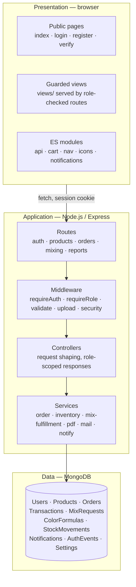
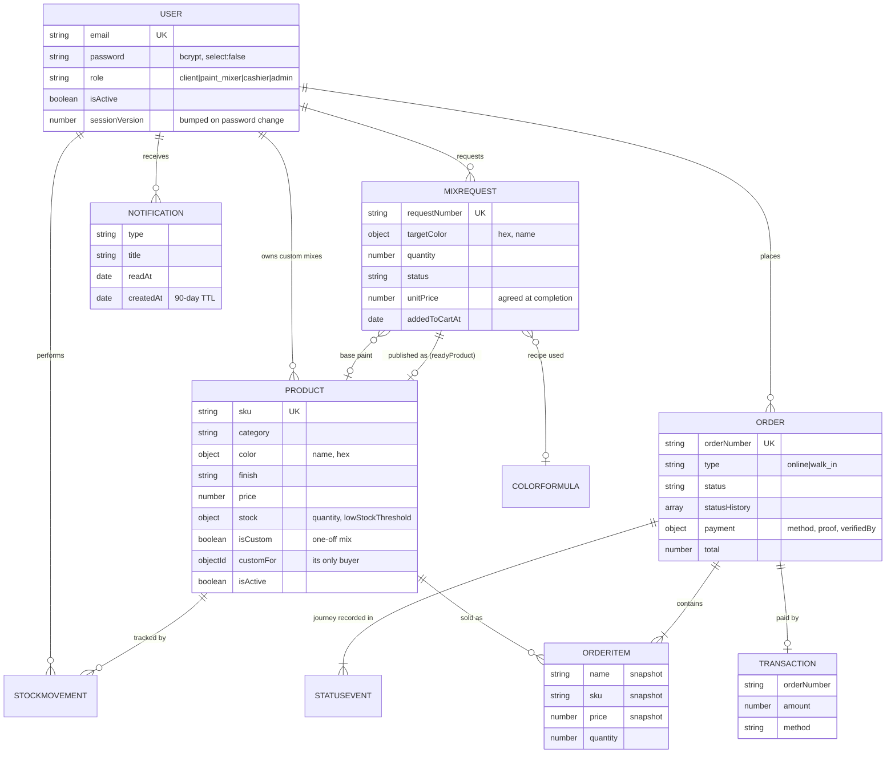
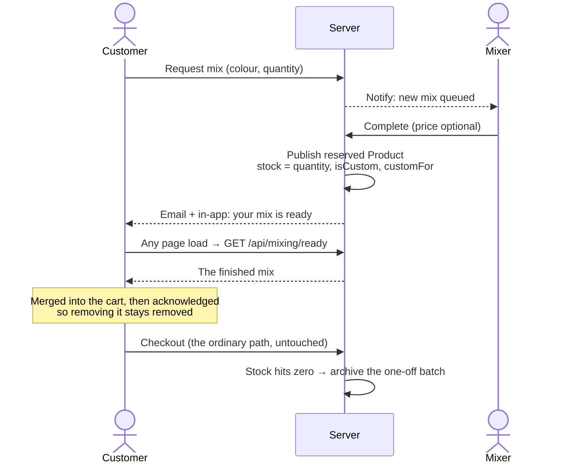

# Architecture

## Three tiers

Presentation is vanilla HTML/CSS/ES modules — no framework, no build step.
Every protected page is served by a role-checked Express route rather than
sitting in the public folder, so access control never depends on the client.

## Data model

Order items **snapshot** name, SKU and price. Editing the catalogue later
never rewrites what a customer was charged.

## How a custom mix becomes a purchase

The mixing workshop and the shop were originally separate: a `MixRequest`
had no price and no stock, and the order engine prices strictly from
catalogue products. Rather than teaching orders about mixes — which would
mean rewriting pricing, stock reservation, invoices and reports — completing
a mix *publishes* it as a product reserved for that one customer.

## Rules the code holds to

| Rule | Where it lives |
|---|---|
| Stock only changes through one audited function | `inventory.service.adjustStock` |
| Order state only changes through one function | `order.service.transition` |
| Prices come from the catalogue, never the client | `order.service.priceItems` |
| A customer's data is scoped in the controller, and a miss is a 404 | every `loadOrderForUser`-style helper |
| Notifications and email can fail without breaking the flow | `notify.service`, `mail.service`, `audit.service` |
| Catalogue queries exclude other people's custom mixes | `isCustom: { $ne: true }` — pre-existing rows have no such field |
